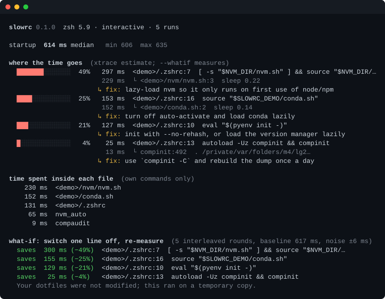

# slowrc

**Find out why your shell takes so long to start, and measure what each fix would really save.**

[](https://github.com/Nithinfgs/slowrc/actions/workflows/ci.yml)
[](LICENSE)




<sub>Real output of `npx github:Nithinfgs/slowrc --demo --whatif`. The slow tools in the demo are simulated with `sleep`; your own run measures your own files.</sub>

## In 20 seconds

Every new terminal tab runs your `.zshrc`, `.zprofile` and friends. One lazy `nvm`, `conda init` or `eval "$(tool init)"` can add half a second to every tab, and nothing tells you which line is to blame.

`slowrc` starts your shell with tracing on, charges every millisecond to the line that caused it (including everything that line `source`s), and then does the part guesses can't: it switches each hot line off, one at a time, on a throwaway copy of your dotfiles and re-times the real startup. You get "removing line 25 saves 106 ms", not "line 25 looks slow".

It reads your startup files and runs your shell. It never edits your dotfiles.

## Quick start

```bash
npx github:Nithinfgs/slowrc --demo --whatif   # try it on a bundled slow setup, touches none of your files
npx github:Nithinfgs/slowrc --whatif          # profile your own shell (zsh)
```

Needs Node 18.3 or newer and a shell on your `PATH`. No dependencies are installed beyond slowrc itself.

To keep it around:

```bash
git clone https://github.com/Nithinfgs/slowrc && cd slowrc && npm link
slowrc --whatif
```

## Why this exists

The usual workflow is to add `zmodload zsh/zprof` to your `.zshrc`, read a function-level table, then hand-roll an `xtrace` with a custom `PS4` to find the actual line. `zprof` only knows about functions, and `xtrace` timings are only a proxy: tracing itself changes the cost, and some lines (a `brew shellenv`, say) are traced as cheap but turn out to cost much more. slowrc automates the trace and then checks it against reality.

Honest comparison with neighbours:

- [`zsh-bench`](https://github.com/romkatv/zsh-bench) measures what you *feel* (first prompt lag, input lag) in a virtual terminal. Great for comparing setups; it doesn't point at lines. Use it alongside slowrc.
- `zprof` is built in and function-level.
- Hand-rolled `xtrace` gives per-line numbers but no nesting rollup and no check against real timing.

## Example

```text
$ slowrc --whatif
startup  168 ms median   min 164  max 169

where the time goes  (xtrace estimate; --whatif measures)
  █████████░░░░░  62%  103 ms  ~/.zshrc:25  …
  ██░░░░░░░░░░░░  16%   26 ms  ~/.zshrc:20  [ -s "~/.bun/_bun" ] && source "~/.bun/_bun"
                        12 ms  └ compinit:492
                       ↳ fix: use `compinit -C` and rebuild the dump once a day
  █░░░░░░░░░░░░░   7%   12 ms  ~/.zprofile:6  eval "$(brew shellenv)"
                       ↳ fix: hard-code the Homebrew prefix instead of calling brew

what-if: switch one line off, re-measure  (3 interleaved rounds, baseline 169 ms, noise ±5 ms)
  saves  106 ms (−63%)  ~/.zshrc:25
  saves   40 ms (−24%)  ~/.zprofile:6        <- traced as 12 ms, really costs 40
  saves   19 ms (−11%)  ~/.zshrc:20
```

(Abridged from a run on the author's own Mac; the first row's text is elided here. It's a long line from the author's rc file.)

## Features

- **Per-line attribution with nesting.** A `source ~/.nvm/nvm.sh` line is charged for everything nvm.sh did, and you can see which inner line dominated.
- **`--whatif`: measured savings.** Each hot line is replaced by a no-op in a temporary copy (via `ZDOTDIR`), the copy is syntax-checked with `zsh -n`, and startup is re-timed. Baseline and variants run in interleaved rounds so machine drift hits them equally, and anything inside the noise band is labelled as such.
- **Fix hints for common offenders**: nvm, pyenv/rbenv/etc., conda, `compinit`, `brew shellenv`, completion `eval`s, oh-my-zsh, gcloud, sdkman/asdf/rvm, ssh-agent, and generic `eval "$(…)"`. `--snippets` prints a paste-ready replacement. Hints are advice; `--whatif` is the evidence.
- **Safe to share.** `--no-source` hides the text of your rc lines; home paths are shown as `~`.
- **CI-friendly.** `--json` for machines and `--budget <ms>` exits non-zero when median startup is over budget, so a dotfiles repo can guard against regressions.
- **Zero runtime dependencies.** Plain Node ES modules.

## How it works

1. **Time it.** Run `shell -l -i -c exit` several times (after a warm-up) and take the median.
2. **Trace it once.** Run it again with `-x` and a custom `PS4` that prints a microsecond timestamp, the file and the line before every command.
3. **Attribute.** The gap between one traced command and the next belongs to the earlier command, and to every command still open above it on the stack. zsh doesn't report depth, so nesting is rebuilt from file and function names (startup files reset the stack). bash 5 reports depth directly.
4. **Match.** The traced command and the files it pulled in are matched against a table of known slow patterns.
5. **Measure (optional).** For each top line, copy your startup files to a temp dir, no-op that one line, point `ZDOTDIR` at the copy, and re-time.

```
slowrc --whatif
   ├─ time ×N ─────────► median startup
   ├─ trace ×1 ────────► cost tree ──► ranked lines + fix hints
   └─ ablate each line ► temp ZDOTDIR copy ► interleaved timing ► measured savings
```

## Use cases

- "My terminal takes a second to open and I don't know why."
- Before and after a dotfiles cleanup, with numbers instead of vibes.
- A CI check in a dotfiles repo: `slowrc --budget 300`.
- Attaching `slowrc --no-source --json` to a bug report for a shell plugin.

## Options

| Option | Meaning |
| --- | --- |
| `--whatif` | measure the real saving of removing each hot line (zsh only) |
| `--demo` | profile the bundled slow setup in `examples/demo-zsh` |
| `--shell zsh\|bash` | shell to profile (default: from `$SHELL`) |
| `--mode login\|interactive` | default is login on macOS, interactive elsewhere |
| `--runs N` / `--rounds N` | timed startups / what-if rounds (default 5 / 5) |
| `--top N` | rows shown (default 8) |
| `--budget MS` | exit 1 if median startup is slower |
| `--snippets` | print a fix snippet under each hint |
| `--no-source` | hide the text of your rc lines |
| `--json` | machine-readable output |
| `--no-color` | plain text (also honours `NO_COLOR`; `FORCE_COLOR` forces colour) |

Exit codes: `0` ok, `1` over budget, `2` error or bad usage.

## Limitations

- `--whatif` is zsh only, because it relies on `ZDOTDIR` to run against a copy. bash gets the trace and hints.
- bash needs version 5+ (`$EPOCHREALTIME`). macOS ships bash 3.2; `brew install bash` or use zsh. fish and others are not supported yet.
- bash support is covered by an integration test that runs in CI on Linux; zsh is also tested on macOS.
- Removing a line can change what runs after it (a later line may depend on it), so what-if numbers are the saving of *that edit in your setup*, not a promise about every refactor. Lines that can't be removed alone without breaking syntax (parts of an `if` block) are skipped and reported as such.
- Startup files read through symlinks are followed. Startup files outside `ZDOTDIR`/`$HOME`, and `/etc` files, are shown but not what-if candidates.
- Timings vary run to run. slowrc reports the noise band; use `--runs` and `--rounds` to tighten it.
- It measures time to a working shell, not prompt-rendering or keystroke latency. For that, use `zsh-bench`.

## Roadmap

- fish support
- `--html` report you can share
- bash `--whatif` via `--rcfile`
- more hints (plugin managers, `direnv`, language servers)
- a `--watch` mode that re-profiles after each edit

Ideas and slow patterns you've found are very welcome as issues.

## Contributing

See [CONTRIBUTING.md](CONTRIBUTING.md). The most valuable contribution is a new hint: a pattern, a fix, and evidence it helps. Run `npm test` and `npm run lint` before opening a PR.

## License

[MIT](LICENSE)
